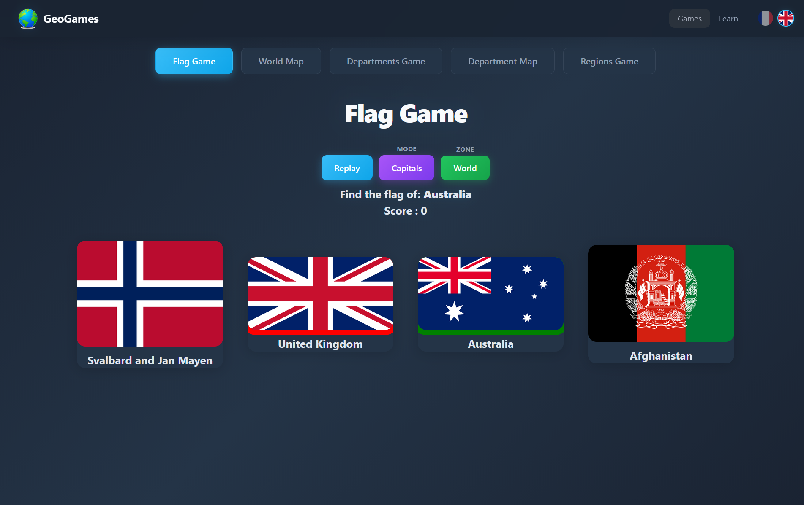
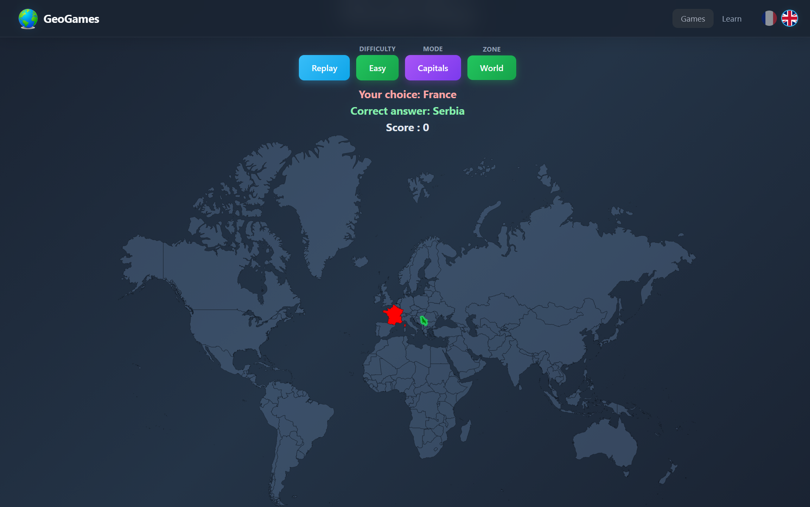
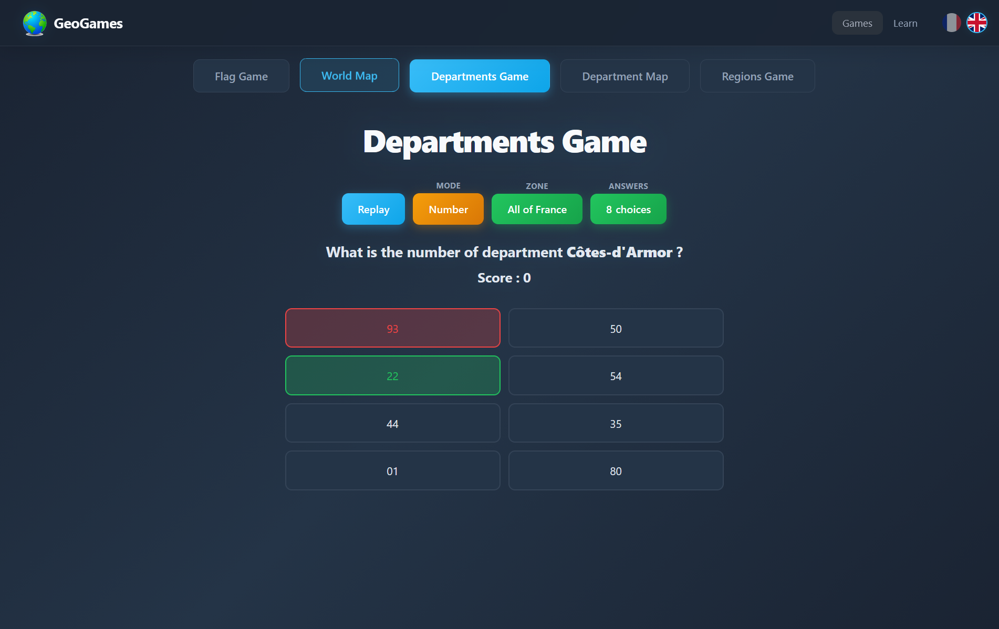
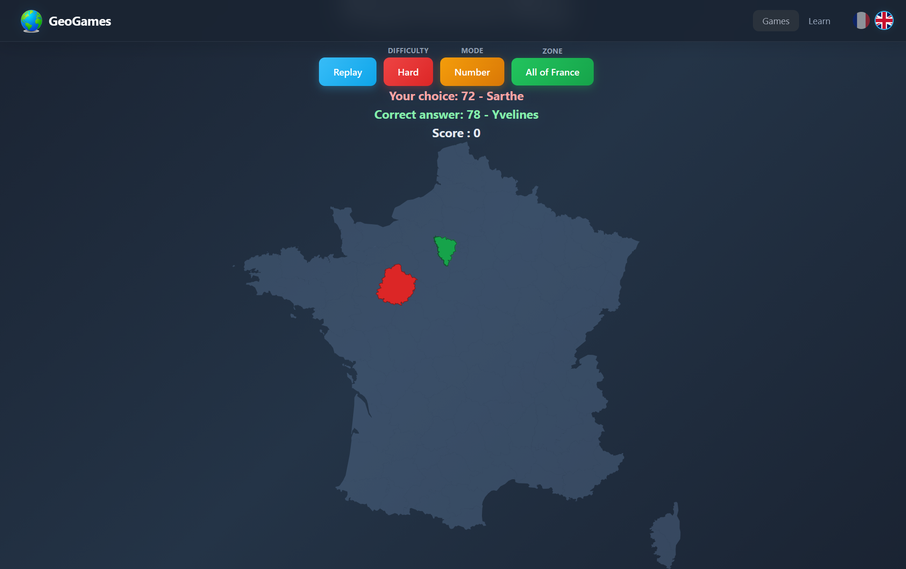
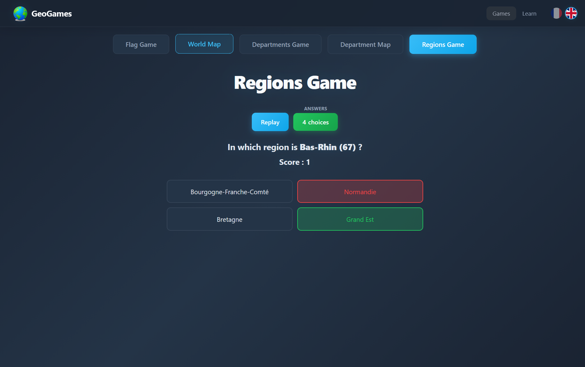
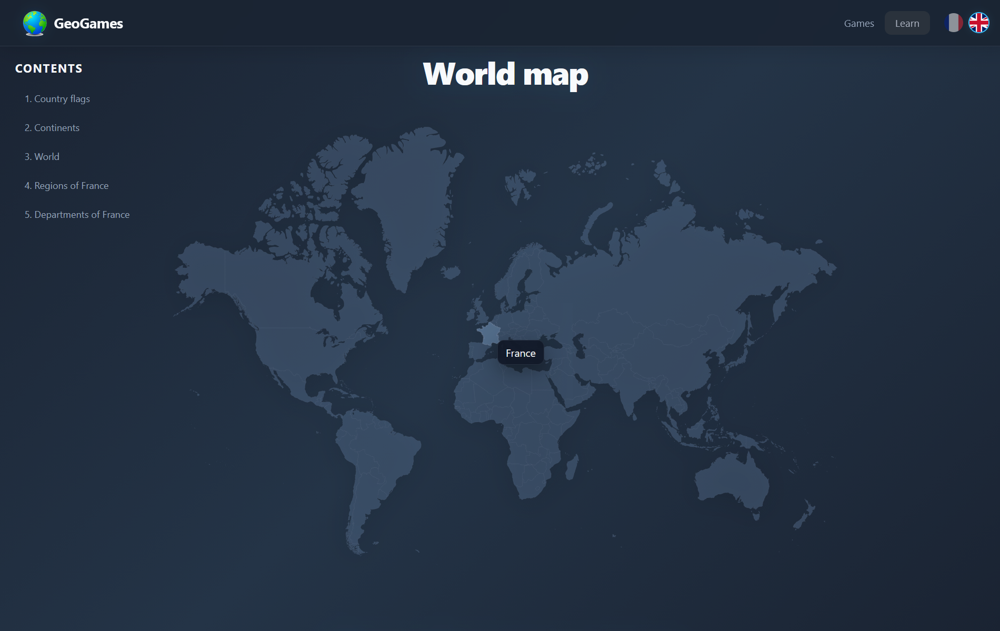

# GeoGames

GeoGames is an interactive geography learning platform that makes exploring the world fun and educational.

## Game Modes

- Flag quiz
- World map quiz
- French departments quiz
- French departments map quiz
- French regions quiz

## Features

- French and English interface
- Zone filters (world and continents)
- Multiple answer counts (2, 4, 8 depending on mode)
- Easy/Hard difficulty on map games
- Immediate score feedback

### Feature Preview

| Flag Game | World Map Game |
| --- | --- |
|  |  |

| Departments Game | Department Map Game |
| --- | --- |
|  |  |

| Regions Game | Learn - World Map |
| --- | --- |
|  |  |

## Run Locally

1. Clone or download this repository.
2. Open `index.html` in a modern browser.
3. Play directly, no build step required.

## License

Personal project - all rights reserved.